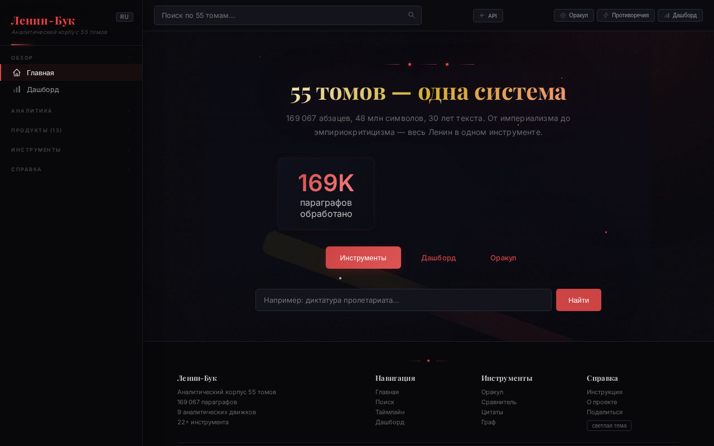
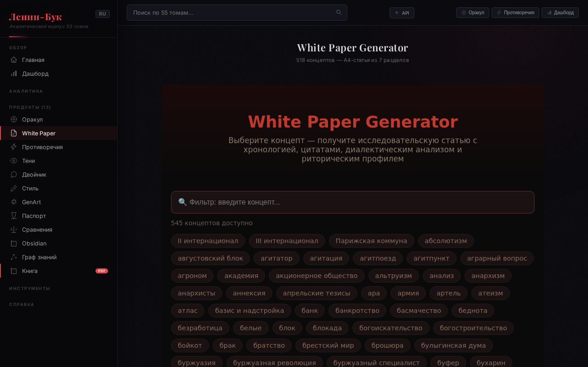
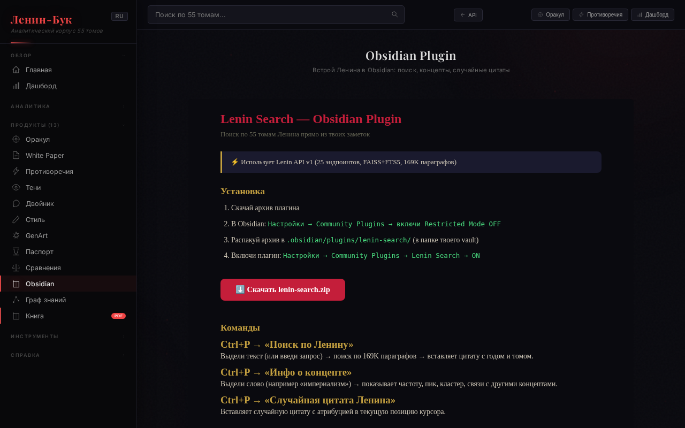
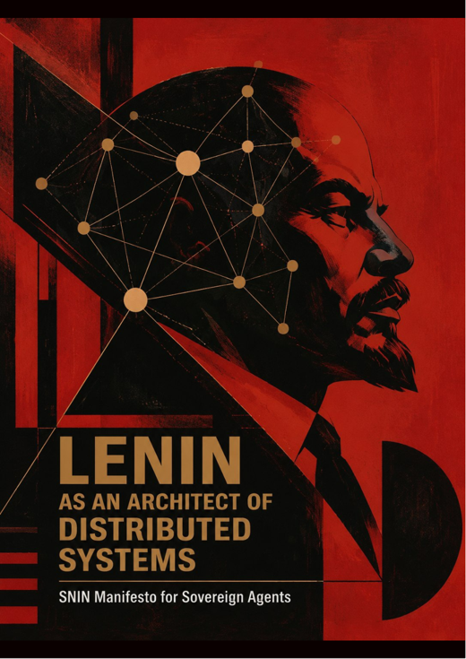
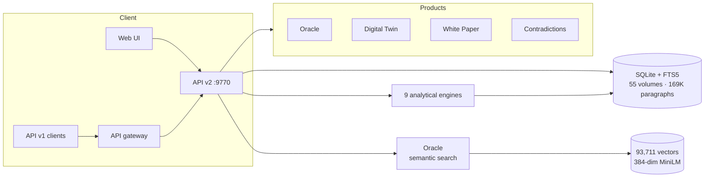

# Lenin-Book 📚

**V.I. Lenin's Complete Works — Search, Analyze, Explore.**

169,067 paragraphs across 55 volumes (1893–1922). 9 analytical engines, semantic Oracle, REST API, and a 118-page book.

[](https://lenin-book.v2.site)
[]()
[](LICENSE)
[](https://github.com/konantgit-sys/lenin-lab/actions/workflows/tests.yml)
[]()
[](https://lenin-book.v2.site/lenin_book_v5.8.3.pdf)

> ⚠️ **Beta status:** Engines + API v1 are production-ready (100 tests). Products (Digital Twin, White Paper, Contradictions) are in development — some return 502. Oracle (semantic search) is live. See [Roadmap](#roadmap).

---

## Screenshots

| Main dashboard | Concept graph |
|---|---|
|  |  |

| Semantic Oracle | Book (118 pages) |
|---|---|
|  | [](https://lenin-book.v2.site/lenin_book_v5.8.3.pdf) |

**📖 The book:** [*«Ленин как архитектор распределённых систем»* — 200 theses, 118 pages, PDF](https://lenin-book.v2.site/lenin_book_v5.8.3.pdf)

---

## What Makes This Different

Nobody has built a **specialized single-author analytical platform** at this depth. General tools exist (Voyant, BookNLP, AntConc) — but they analyze "any text". Lenin-Book is purpose-built for Lenin's 55-volume corpus with domain-specific engines.

| Layer | Count | What |
|---|---|---|
| Engines | 9 | Chronology, Concepts, Dialectics, Opponents, Time Machine, Rhetoric, Positions, Quotes, Comparative |
| Products | 10 | Oracle, Digital Twin, White Paper, Contradictions, Style Mimic + 5 more |
| API v1 | 15 endpoints | Search, Timeline, Concepts, Rhetoric, Entropy, Tomography, Phantoms, Compare |
| Oracle | 93,711 vectors | Semantic search, local MiniLM-L12 embeddings (384-dim), FAISS index |
| Tests | 100/100 | 13.6 seconds |
| Concepts | 206 | Louvain clusters (8), co-occurrence edges (12,735) |

---

## Quick Start

```bash
# 1. Clone
git clone https://github.com/konantgit-sys/lenin-lab.git
cd lenin-lab

# 2. Install
pip install -r requirements.txt          # FastAPI, uvicorn, networkx
pip install fastembed faiss-cpu          # semantic Oracle (optional)

# 3. Run API (port 9770)
python3 api_v2.py --port 9770            # or: uvicorn api_v2:app --port 9770

# 4. Open the site — serve this directory statically:
python3 -m http.server 8080              # then open http://localhost:8080
```

**Data note:** the full corpus (169K paragraphs) lives in a SQLite database not shipped in this repo — run `python3 api_v2.py --build-caches` after loading your own `lenin.db` into the project dir.

---

## Architecture



---

## API v1 (Stable)

### Quick Start

```bash
# 1. Get a free API key (100 requests/day)
curl -X POST "https://lenin-book.v2.site/api/v1/register?tier=free"

# 2. Search Lenin's works
curl "https://lenin-book.v2.site/api/v1/search?q=революция&limit=5" \
  -H "X-API-Key: YOUR_KEY"

# 3. Get corpus stats
curl "https://lenin-book.v2.site/api/v1/stats" \
  -H "X-API-Key: YOUR_KEY"
```

### Endpoints

| Method | Endpoint | Description |
|---|---|---|
| `POST` | `/api/v1/register?tier=free` | Get API key |
| `GET` | `/api/v1/health` | Database health + cache status |
| `GET` | `/api/v1/stats` | Corpus statistics |
| `GET` | `/api/v1/search?q=...&limit=20&year=1917` | FTS5 full-text search |
| `GET` | `/api/v1/timeline/{year}` | Year chronology with volume breakdown |
| `GET` | `/api/v1/quotes?n=5&topic=...` | Random quotes (80-400 chars) |
| `GET` | `/api/v1/concepts` | Full concept graph |
| `GET` | `/api/v1/concept/{name}` | Single concept detail |
| `GET` | `/api/v1/compare?y1=1917&y2=1905` | Year comparison |
| `GET` | `/api/v1/rhetoric` | Rhetorical fingerprint (25 years, 5 axes) |
| `GET` | `/api/v1/entropy` | Textual entropy over time |
| `GET` | `/api/v1/phantoms?year=1917` | Phantom opponents |
| `GET` | `/api/v1/tomography?n=1000` | Semantic 2D projection |

### Rate Limits

| Tier | Requests/day | Price |
|---|---|---|
| `free` | 100 | $0 |
| `basic` | 1,000 | $3.75/mo |
| `pro` | 10,000 | $11.25/mo |
| `enterprise` | Unlimited + dedicated instance | $99/mo |

### Error Handling

All errors return HTTP 200 (proxy-friendly) with `error: true`:

```json
{"error": true, "code": 401, "detail": "Missing API key"}
{"error": true, "code": 403, "detail": "Invalid API key"}
{"error": true, "code": 429, "detail": "Rate limit exceeded"}
```

### Security

- API key validation on all endpoints (middleware)
- Rate limiting per tier
- CORS restricted to `lenin-book.v2.site`
- FTS5 injection sanitized
- Internal errors hidden: `"internal error"` → server-side log
- Input validation: year range, query non-empty, limit bounds

---

## Tech Stack

- **Backend:** Python 3.11 + FastAPI + uvicorn
- **Database:** SQLite 3 + FTS5 (full-text search, RU + EN)
- **Semantic search:** FAISS + sentence-transformers `paraphrase-multilingual-MiniLM-L12-v2` (local, no external API)
- **Graph:** NetworkX + Louvain community detection
- **Analytics:** Precomputed JSON caches
- **Deploy:** V2Bot platform, `*.v2.site`

---

## Development

```bash
# Run tests (100 tests, ~10s)
python3 -m pytest tests/ -v

# Start API server (port is a positional arg)
python3 api_v2.py 9770

# Regenerate caches (after DB update)
python3 api_v2.py --build-caches
```

**CI mode:** GitHub Actions runs the suite without the 770 MB corpus DB — the
16 cache-based unit tests always run, DB/API-contract tests auto-skip
(`conftest.py`). A local run with the full DB executes all 100 tests.

---

## Roadmap

| Priority | What | Status |
|---|---|---|
| 🔴 | Oracle semantic search | ✅ Live (93,711 vectors, local model) |
| 🟡 | Fix product APIs (Digital Twin, White Paper, Contradictions) | Next |
| ✅ | Analytics — self-hosted (parses access logs, no third-party) | ✅ Live |
| 🟡 | REST API docs page on site | Planned |
| 🟢 | Obsidian Plugin polish | Planned |
| 🟢 | Multi-author expansion (Marx, Engels, Trotsky) | Future |

---

## License

**Code:** GNU Affero General Public License v3.0 (AGPLv3) — see [LICENSE](LICENSE).

**Data** (corpus annotations, concept graph, rhetoric fingerprints): Creative Commons BY-NC-SA 4.0.

Contributions are welcome — see [CONTRIBUTING.md](CONTRIBUTING.md).

---

## Built with V2Bot

Lenin-Lab was co-created with **V2Bot Agent** — an AI assistant that plans, codes, deploys and polishes products end-to-end: from the corpus pipeline and 9 analytical engines to the semantic Oracle, the 118-page book and this very README.

👉 [v2bot.ai](https://v2bot.ai/?r=FC28B6B3) — build your own project with V2Bot.

© 2026 @AnKocrypto + V2Bot Agent.
